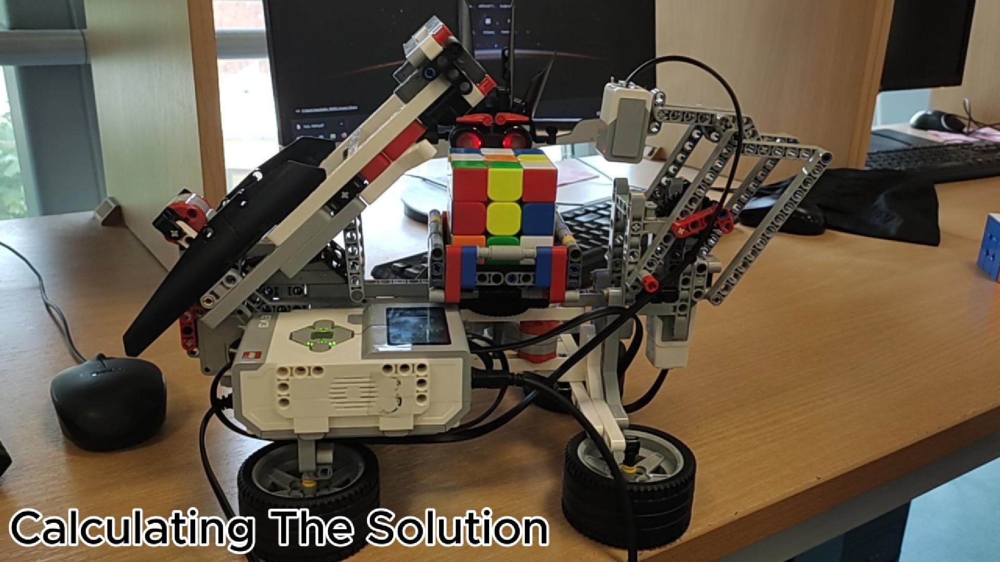

# LEGO EV3 Rubik's Cube Solver Robot (ZZ Method)

## Demo

See the robot in action on YouTube.

## About

This repository contains a custom ZZ-method Rubik's Cube solver and the EV3 MicroPython code that scans, plans, and physically solves the cube using a LEGO Mindstorms EV3 robot.

The physical robot design is based on the MindCub3r LEGO EV3 Rubik's Cube solver concept. The software stack in this repository, including the solver, EV3 control system, calibration, and solving workflow, is my own implementation built on top of that hardware inspiration.

## How it works

The project is split into two main parts:

- `ZZ SOLVER/` - desktop Python code for the ZZ cube solver
- `EV3 Source Code/` - EV3 MicroPython robot control system

The overall workflow is:

1. Scan the cube state
2. Convert the scanned stickers into the internal cube representation
3. Compute a solution with the ZZ solver
4. Translate the solution into robot motor actions
5. Execute the solve physically on the EV3 robot

## Repository Structure

- `ZZ SOLVER/` - Python-based ZZ cube solver
- `EV3 Source Code/` - MicroPython EV3 robot control system
- `assets/` - preview media and mapping images

## Sticker mapping reference

| Cube layout | Edge sticker mapping | Corner sticker mapping |
|---|---|---|
|  |  |  |

## Building instructions

The robot build was based on the MindCub3r LEGO EV3 Rubik's Cube solver concept.

- Project site: [MindCub3r](https://mindcuber.com/mindcub3r/mindcub3r.html)
- Building instructions: [MindCub3r v1.0 PDF](https://mindcuber.com/mindcub3r/MindCub3r-v1p0.pdf)

## License

The original code in this repository is released under the MIT License. See [LICENSE](LICENSE).

Third-party reference material remains under its original terms and is not re-licensed here.
