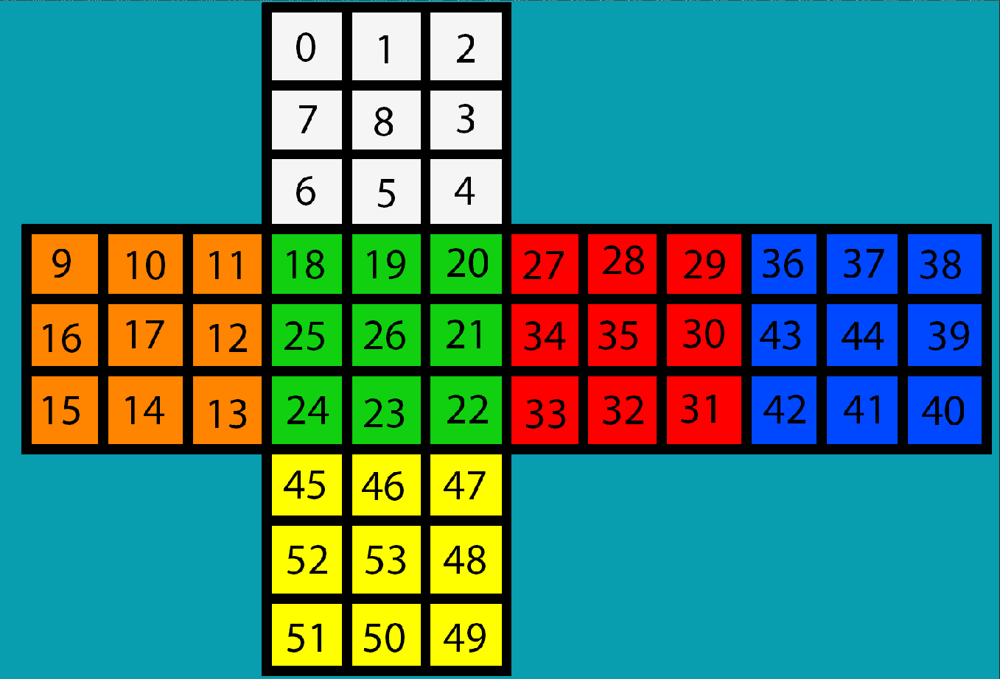
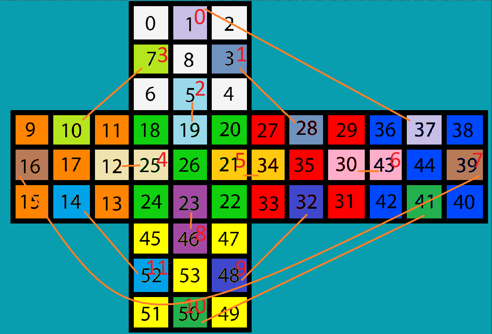
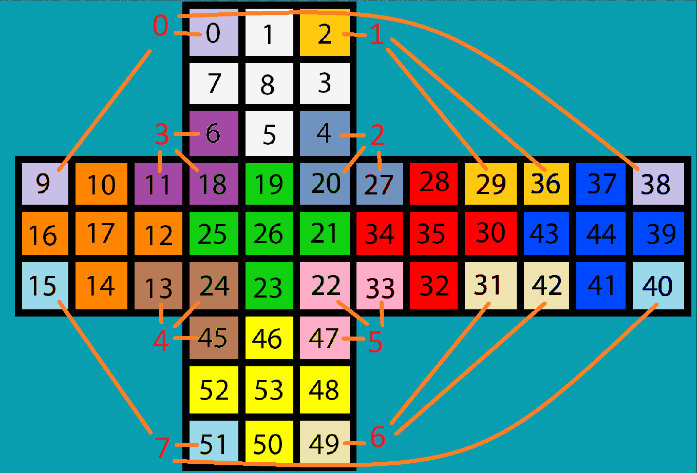

# LEGO EV3 Rubik's Cube Solver Robot (ZZ Method)

## TL;DR

A LEGO EV3 Rubik's Cube solving robot system built with a custom Python ZZ-method solver and a full robot control pipeline.

## Visual Preview

<table>
  <tr>
    <td align="center">
       
      <strong>Cube layout</strong>
    </td>
    <td align="center">
       
      <strong>Edge mapping</strong>
    </td>
    <td align="center">
       
      <strong>Corner mapping</strong>
    </td>
  </tr>
</table>

Watch the combined demo video here:

- [YouTube demo video](https://youtu.be/wWMvnwSBlZk)

## About

This repository contains a custom ZZ-method Rubik's Cube solver and the EV3 MicroPython code that scans, plans, and physically solves the cube using a LEGO Mindstorms EV3 robot.

The physical robot design is based on the MindCub3r LEGO EV3 Rubik's Cube solver concept. The software stack in this repository, including the solver, EV3 control system, calibration, and solving workflow, is my own implementation built on top of that hardware inspiration.

## My contribution

- Implemented a custom ZZ-method Rubik's Cube solver in Python
- Developed the EV3 MicroPython control system for robot execution
- Designed the full solving workflow: scan, solve, and motor execution
- Implemented cube state representation and move translation
- Handled calibration and robot movement logic

## Repository Structure

- `ZZ SOLVER/` - Python-based ZZ cube solver
- `EV3 Source Code/` - MicroPython EV3 robot control system
- `assets/` - demo videos and visual documentation

## Demo & Assets

This project includes:

- Combined scanning and solving demonstration video
- Sticker mapping and cube state diagrams

See [assets/README.md](assets/README.md) for the visual references and media gallery.

## License

The original code in this repository is released under the MIT License. See [LICENSE](LICENSE).

Third-party reference material remains under its original terms and is not re-licensed here.
